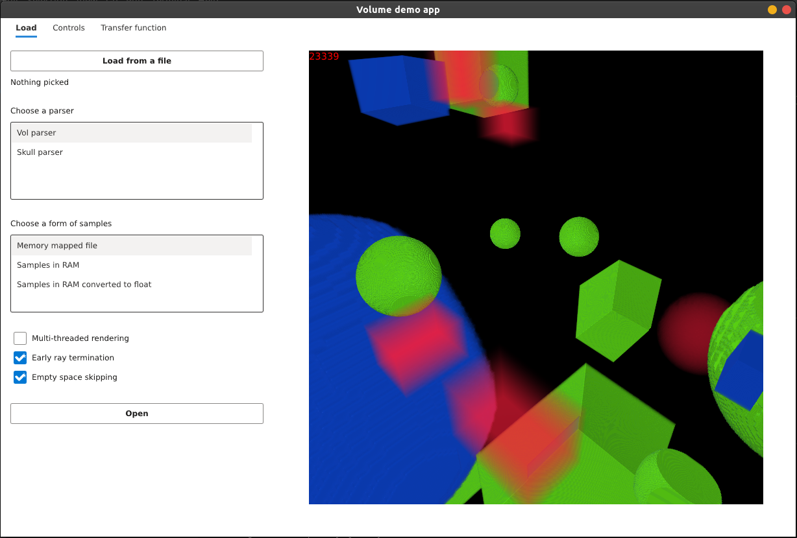

# CPU Rendering of Large Volumetric Data

Scroll down for [Czech version](#Zobrazení-rozsáhlých-volumetrických-dat-na-CPU)

2021/2022 Bachelor's thesis

Direct volumetric raycasting library written in Rust




# Zobrazení rozsáhlých volumetrických dat na CPU

## Obsah
1. [Základní informace](#základní-informace)
2. [Překlad a spouštění](#překlad-a-spouštění)
3. [Dokumentace](#dokumentace)
4. [Testování](#Testovani)

# Základní informace

Název práce:    Zobrazení rozsáhlých volumetrických dat na CPU

Autor:          Michal Majer

Vedoucí práce:  Ing. Španěl Michal, Ph.D.

Datum:          19.4.2022

## Obsah média
```
.
├── BP_xmajer21.pdf
├── plakat.pdf
├── zdroj/
│   ├── raycaster\_lib/
│   │   ├── benches
│   │   ├── src
│   │   └── tests
│   ├── vol\_app
│   ├── vol\_gen
│   ├── volumes/
│   │   └── Skull.vol       // Data pro běh demo aplikace
│   ├── Cargo.toml
│   └── Cargo.lock
├── bin/
│   ├── vol\_app
│   └── vol\_gen
├── docs                    // Vygenerovaná dokumentace
├── bp\_tex /               // Zdrojové texty BP
│   └── Makefile
└── README.md
```

# Překlad a spouštění

Práce využívá jazyk *Rust* a nástroj *Cargo*.
Doporučený postup je popsán [zde](https://www.rust-lang.org/tools/install).

Projekt je (dne `2022-04-19`) přeložitelný na nejnovější stabilní verzi jazyka (`1.60.0`).

**Varování**: Výstup překladu (složka `target`) může přesáhnout `10GB`.

## Seznam závislostí

* `cmake`
* `fontconfig`
* `libxcb`

## Postup instalace všech závislostí

Následuje postup instalace všech závislostí potřebných pro přeložení a spuštění projektu.
Postup byl vyzkoušen na čisté instalaci [Ubuntu 20.04](https://releases.ubuntu.com/20.04/).

```
sudo apt update
sudo apt upgrade
```

```
sudo apt install cmake
```

```
sudo apt install fontconfig-config libfontconfig libfontconfig1-dev
```

```
sudo apt install libxcb1-dev libxcb-keysyms1-dev libpango1.0-dev \
libxcb-util0-dev libxcb-icccm4-dev libyajl-dev \
libstartup-notification0-dev libxcb-randr0-dev \
libev-dev libxcb-cursor-dev libxcb-xinerama0-dev \
libxcb-xkb-dev libxkbcommon-dev libxkbcommon-x11-dev \
autoconf libxcb-xrm0 libxcb-xrm-dev automake libxcb-shape0-dev libxcb-xfixes0-dev
```

## překlad

Překlad probíhá přes nástroj `cargo` (případně `rustc`).

Příkaz `cargo build --release` přeloží všechny součásti projektu s optimalizacemi (žádoucí).
Překlad je inkrementální a překládají se i závislosti.

Profil s maximální optimalizací (a pomalým překladem): `release-full`.
Překlad a spouštění s tímto profilem:
```
cargo build --profile release-full
```

Připadně lze překládat s proměnnou `RUSTFLAGS="-C target-cpu=native"`

## Spouštění

Projekt se skládá ze dvou spustitelných aplikací, `vol_app` a `vol_gen`.

Kompilace a spuštění demo aplikace
```
cargo run --release --bin vol_app
// nebo s vyšší optimalizací:
cargo run --profile release-full --bin vol_app
```
Přeložená aplikace se nachází v `target/release/vol_app`.

Kompilace a spuštění aplikace pro generování objemů
```
cargo run --release --bin vol_gen
```
Přeložená aplikace se nachází v `target/release/vol_gen`.
`vol_gen` přijímá argumenty přes příkazovou řádku.
Jejich formát lze zjistit příkazem `cargo run --release --bin vol_gen -- --help`.

Výstup `--help` pro `vol_gen`:
```
USAGE:
    vol_gen [OPTIONS] --dims=<X>,<Y>,<Z> --generator <NAME>

OPTIONS:
    -d, --dims=<X>,<Y>,<Z>      Dimensions of volume
    -g, --generator <NAME>      Type of generator [possible values: shapes, noise, solid]
    -h, --help                  Print help information
    -l, --layout <SHAPE>        Layout of samples in memory [default: linear] [possible values:
                                linear, z]
    -o, --output-file <FILE>    File name to output [default: a.vol]
    -s, --shape=<X>,<Y>,<Z>     Shape of cell [default: 1 1 1]
        --seed <SEED>           Seed for RNG, leave out for random seed
    -V, --version               Print version information
``` 

Příklady spuštění `vol_gen`:
```
cargo run --release --bin vol_gen -- --dims=100,100,100 --generator solid --sample 42 --output-file volumes/100_solid.vol

cargo run --release --bin vol_gen -- --dims=200,200,200  --generator shapes --n-of-shapes 30 --sample 100 --output-file volumes/shapestest.vol

cargo run --release --bin vol_gen -- --dims=800,800,800  --generator shapes --n-of-shapes 50  --sample 100 --output-file volumes/shapestest_block16.vol --seed 1 --layout z --block-size 16
```

# Dokumentace

Pro vygenerování dokumentace použijte příkaz
```
cargo doc --no-deps
```
Argumentem `--open` se dokumentace automaticky otevře v prohlížeči, argument `--document-private-items` vygeneruje dokumentaci i neveřejných částí kódu.

# Testovani

Testovaci framework Criterion vyzaduje program `perf`.
Unit testy, docs testy a integrační testy se spouští příkazem `cargo test`.
Benchmarky se spouštějí příkazem `cargo bench`.

## Data

| Objem | Soubor | Rozlišení | velikost | TF |
| ----------- | ---------- | ---------- | ---------- | ---------- |
| 1 | `volumes/800shapes_lin.vol` | 800 | 512MB | `shapes` |
| 2 | `volumes/800shapes_block16.vol` | 800 | 645MB | `shapes` |
| 4 | `volumes/2kshapes_lin.vol` | 2000 | 8GB | `shapes` | d |
| 4 | `volumes/2kshapes_block16.vol` | 2000 | 9.8GB | `shapes` |
| 5 | `volumes/4kshapes_block16.vol` | 4000 | ~75GB | `shapes` |

## Generování dat

Objem #1
```
cargo run --release --bin vol_gen -- --dims=800,800,800 --generator shapes --seed 2 --n-of-shapes 70 --sample 100 --output-file volumes/800shapes_lin.vol --layout linear --object-size 70
```

Objem #2
```
cargo run --release --bin vol_gen -- --dims=800,800,800 --generator shapes --seed 2 --n-of-shapes 70 --sample 100 --output-file volumes/800shapes_block16.vol --layout z --block-size 16 --object-size 70
```

Objem #3
```
cargo run --release --bin vol_gen -- --dims=2000,2000,2000 --seed 2 --layout linear  --generator shapes --n-of-shapes 140 --sample 100 --output-file volumes/2kshapes_lin.vol --object-size 140
```

Objem #4
```
cargo run --release --bin vol_gen -- --dims=2000,2000,2000 --seed 2 --layout z --block-size 16  --generator shapes --n-of-shapes 140 --sample 100 --output-file volumes/2kshapes_block16.vol --object-size 140
```

Objem #5
```
cargo run --release --bin vol_gen -- --dims=4000,4000,4000 --seed 2 --layout z --block-size 16  --generator shapes --n-of-shapes 300 --sample 100 --output-file volumes/4kshapes_block16.vol --object-size 190
```
